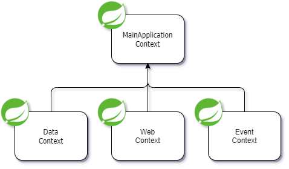

# Multiple Hierarchical Contexts in Spring Boot

### TL;DR

In addition to creating **only one** [`ApplicationContext`](https://docs.spring.io/spring-framework/docs/current/javadoc-api/org/springframework/context/ApplicationContext.html) 
in a typical Spring Boot application, there is possibility to 
create **multiple** instances of `ApplicationContext` in a single 
_Spring Boot_ application. These contexts can form parent-child 
relationships between them. This way we don't have anymore a single 
`ApplicationContext` containing all _beans_ defined in the 
application. Rather we can have a hierarchy of contexts each 
containing _beans_ defined within themselves. In addition, 
forming the parent-child relationships between contexts, 
accessibility of _beans_ defined in a context can be 
controlled.

### Introduction

In a typical _Spring Boot_ application written in _Java_, our main method will look 
like the one below.

```java
@SpringBootApplication
public class MainApplication {

    public static void main(String[] args) {
        SpringApplication.run(MainApplication.class, args);
    }

}
```

Static method `run` from [`SpringApplication`](https://docs.spring.io/spring-boot/docs/current/api/org/springframework/boot/SpringApplication.html) 
class will create a single `ApplicationContext`. 
The context will contain all custom _beans_ defined 
in the application, as well as _beans_ which will be created during 
_Spring_'s auto-configuration process. This means that wherever in our 
application we can request any _bean_ from the context to be autowired 
with _Spring_'s dependency injection mechanism. In most cases 
this will be desired way to do.

But there could be situations where we wouldn't like that all defined 
_beans_ are accessible within the whole application. Maybe we would 
like to restrict access on some specific _beans_ because some part 
of the application shouldn't know about them. The real-world
example could be that we have _multi-modular_ project, and we 
don't want that _beans_ defined in one module know about _beans_ 
defined in other modules. Another example could be that in a typical 
3-layer architecture (controller-service-repository) we restrict 
access to controller _beans_ from repository related _beans_.

_Spring Boot_ enables creating multiple contexts
with its [Fluent Builder API](https://docs.spring.io/spring-boot/docs/current/reference/htmlsingle/#features.spring-application.fluent-builder-api).
Class which is in the core of this API is [`SpringApplicationBuilder`](https://docs.spring.io/spring-boot/docs/current/api/org/springframework/boot/builder/SpringApplicationBuilder.html).

### Single context application

We will start with a simple _Spring Boot_ application having 
only one context. The application will be written in _Java_ 
and will use _Maven_ as building tool.

The application will contain only core _Spring_ and 
_Spring Boot_ dependencies with help of 
_spring-boot-starter_. Resulting `pom.xml` file should 
look like the one on the [link](https://github.com/nikolamicic21/spring-boot-multiple-hierarchical-contexts/blob/main/pom.xml).

There are two different packages in the application:

- **web** package
- **data** package

both containing relevant _beans_ (`WebService` and `DataService`). 
Source code of the single context application where `WebService`
has dependency on `DataService` can be found [here](https://github.com/nikolamicic21/spring-boot-multiple-hierarchical-contexts/tree/single-context-webService-dependsOn-dataService).

If we look into the _main_ method and retrieve the context from 
`SpringApplication`'s _run_ method we can query for _beans_ in the 
context like in the code snippet below.

```java
@SpringBootApplication
public class MainApplication {

    public static void main(String[] args) {
        final var context = SpringApplication.run(MainApplication.class, args);
        final var webService = context.getBean(WebService.class);
        final var dataService = context.getBean(DataService.class);
    }

}
```

_Spring_ will resolve both _beans_ and return singleton instances 
by default of both classes (`WebService` and `DataService`).
This means that both _beans_ are accessible from the context 
via _getBean_ method and that _Spring_ can autowire an instance of
`DataService` into the instance of `WebService` via
dependency injection mechanism. 

If we would like for some reason to have reversed scenario where
`DataService` has dependency on `WebService`, instead 
of the first scenario where `WebService` depends on `DataService`, 
we could achieve that as well. _Spring_ will be able to autowire _bean_ of type
`WebService` into the `DataService` _bean_. Source code with reversed
dependency direction can be found [here](https://github.com/nikolamicic21/spring-boot-multiple-hierarchical-contexts/tree/single-context-dataService-dependsOn-webService).

All this is possible because all _beans_ are part of **the same context**.

### Multiple hierarchical contexts

With help of _SpringApplicationBuilder_ we can create multiple 
contexts in our application and form parent-child relationships
between them. This way we can restrict access of the `WebService` 
_bean_ in the way that it cannot be injected into `DataService`.

The rule for multiple context hierarchy with parent-child relationship 
is that all **_beans_ from parent context are accessible in child
contexts**, but not the other way around. In our case context which defines
`WebService` will be child context of the context which defines
`DataService`. Another rule is that a context can have **only one
parent context**.

This could be achieved in a couple of steps:

- Step One would be to create context for web related 
_beans_ in a new class, annotated with [`@Configuration`](https://docs.spring.io/spring-framework/docs/current/javadoc-api/org/springframework/context/annotation/Configuration.html) 
, in the web package. This context will scan all 
_beans_ defined within the web package with help of 
[`@ComponentScan`](https://docs.spring.io/spring-framework/docs/current/javadoc-api/org/springframework/context/annotation/ComponentScan.html). Annotation 
[`@EnableAutoConfiguration`](https://docs.spring.io/spring-boot/docs/current/api/org/springframework/boot/autoconfigure/EnableAutoConfiguration.html) 
will take care of triggering _Spring_'s auto-configuration process.

```java
@ComponentScan
@EnableAutoConfiguration
@Configuration(proxyBeanMethods = false)
public class WebContextConfiguration {
}
```

- Step Two would be to create a context for data related
_beans_ in a new class, annotated with `@Configuration` 
in the data package. _Beans_ defined within the data package 
will be discovered the same way as the ones defined in 
the web package.

```java
@ComponentScan
@EnableAutoConfiguration
@Configuration(proxyBeanMethods = false)
public class DataContextConfiguration {
}
```

- Step Three is to use only [`@SpringBootConfiguration`](https://docs.spring.io/spring-boot/docs/current/api/org/springframework/boot/SpringBootConfiguration.html)
annotation on our main class instead of well-known [`@SpringBootApplication`](https://docs.spring.io/spring-boot/docs/current/api/org/springframework/boot/autoconfigure/SpringBootApplication.html)
annotation in order to prevent component scanning and auto-configuration.
As we saw before, both processes (component scanning and 
auto-configuration) will be done in each child context 
separately.


- Step Four is to use `SpringApplicationBuilder` class instead
of `SpringApplication` class like in the code snippet below.
Method _web_ in `SpringApplicationBuilder` specifies which type of
web application the specific context will define (possible values are
NONE, SERVLET, and REACTIVE defined in [`WebApplicationType`](https://docs.spring.io/spring-boot/docs/current/api/org/springframework/boot/WebApplicationType.html)).

```java
@SpringBootConfiguration
public class MainApplication {

    public static void main(String[] args) {
        new SpringApplicationBuilder()
                .sources(MainApplication.class).web(WebApplicationType.NONE)
                .child(DataContextConfiguration.class).web(WebApplicationType.NONE)
                .child(WebContextConfiguration.class).web(WebApplicationType.NONE)
                .run(args);
    }

}
```

Context hierarchy defined above in the `SpringApplicationBuilder` can
be represented with the following diagram.


If we now try to autowire `WebService` into 
`DataService` _bean_ we will get 
[`NoSuchBeanDefinitionException`](https://docs.spring.io/spring-framework/docs/current/javadoc-api/org/springframework/beans/factory/NoSuchBeanDefinitionException.html)
stating that `WebService` _bean_ cannot be found.
This comes from the statement that _beans_ defined in child 
contexts are not accessible from the parent context.
The source code with these changes can be found [here](https://github.com/nikolamicic21/spring-boot-multiple-hierarchical-contexts/tree/multiple-contexts-dataService-cannot-access-webService).

There will be no exception thrown if we try to autowire `DataService` into
`WebService` as _beans_ defined in parent context
are visible to _beans_ defined in child contexts. Source code
of the application with multiple contexts where `WebService`
depends on `DataService` can be found [here](https://github.com/nikolamicic21/spring-boot-multiple-hierarchical-contexts/tree/multiple-contexts-webService-can-access-dataService).

### Parent-child-sibling context hierarchy

Another interesting hierachy which can be used is when we 
have a single parent context with multiple children
contexts where each child context forms sibling relationship 
with other child contexts.

The rule for sibling contexts is that **_beans_ in one 
sibling context cannot access _beans_ defined in other 
sibling contexts**.

Let us see how the main class for this case looks like.

```java
@SpringBootConfiguration
public class MainApplication {

    public static void main(String[] args) {
        new SpringApplicationBuilder()
                .sources(MainApplication.class).web(WebApplicationType.NONE)
                .child(DataContextConfiguration.class).web(WebApplicationType.NONE)
                .sibling(EventContextConfiguration.class).web(WebApplicationType.NONE)
                .sibling(WebContextConfiguration.class).web(WebApplicationType.NONE)
                .run(args);
    }

}
```

As we can see, we have introduced additional context 
named `EventContextConfiguration` in a separate package named
**event**. The context is defined the similar way like the 
other child contexts.

```java
@ComponentScan
@EnableAutoConfiguration
@Configuration(proxyBeanMethods = false)
public class EventContextConfiguration {
}
```

Diagram for this kind of context hierarchy is shown below.



As we can see from the diagram all child contexts 
share the same parent and form sibling relationship.

If we retain the same dependency hierarchy, where `WebService`
depends on `DataService`, we will now get `NoSuchBeanDefinitionException`
exception, because it is not accessible from the 
sibling context. Source code for this stage of the
application can be found [here](https://github.com/nikolamicic21/spring-boot-multiple-hierarchical-contexts/tree/multiple-sibling-contexts-webService-can-access-dataService). 

One thing to note is that child contexts can still access 
_beans_ defined in the parent context.

### Summary

In this installment we have seen how we can create 
a _Spring Boot_ application containing multiple 
contexts and how they can form parent-child relationships.

We have also mentioned a couple of real-world scenarios
where we could structure contexts in hierarchy and 
what are the reasons to do so.

Also, we have also seen that there are multiple ways 
to form parent-child relationship including sibling 
relationship.

### References

- [Spring Boot Reference Documentation - Fluent Builder API](https://docs.spring.io/spring-boot/docs/current/reference/htmlsingle/#features.spring-application.fluent-builder-api)
- [Domain-Driven Design by Examples - Library Project](https://github.com/ddd-by-examples/library)
- [Context Hierarchy with the Spring Boot Fluent Builder API](https://www.baeldung.com/spring-boot-context-hierarchy)

[main-data-web-contexts-hierarchy-ref]:
data:image/png;base64,iVBORw0KGgoAAAANSUhEUgAAAHkAAAFBCAYAAABTpAA9AAAAAXNSR0IArs4c6QAABIV0RVh0bXhmaWxlACUzQ214ZmlsZSUyMGhvc3QlM0QlMjJhcHAuZGlhZ3JhbXMubmV0JTIyJTIwbW9kaWZpZWQlM0QlMjIyMDIxLTA5LTE2VDIyJTNBMDYlM0EzNC42ODJaJTIyJTIwYWdlbnQlM0QlMjI1LjAlMjAoV2luZG93cyUyME5UJTIwMTAuMCUzQiUyMFdpbjY0JTNCJTIweDY0KSUyMEFwcGxlV2ViS2l0JTJGNTM3LjM2JTIwKEtIVE1MJTJDJTIwbGlrZSUyMEdlY2tvKSUyMENocm9tZSUyRjkzLjAuNDU3Ny44MiUyMFNhZmFyaSUyRjUzNy4zNiUyMiUyMGV0YWclM0QlMjJkdnd1eW82VVFRYTNQT0E3NkxlOCUyMiUyMHZlcnNpb24lM0QlMjIxNS4xLjQlMjIlMjB0eXBlJTNEJTIyZGV2aWNlJTIyJTNFJTNDZGlhZ3JhbSUyMGlkJTNEJTIyNWgxQjF2djd2czExNFkzdWhBOV8lMjIlMjBuYW1lJTNEJTIyUGFnZS0xJTIyJTNFN1ZaTlU5c3dFUDAxUHJialdIR2dSMGdvNVFDVG1Sd29SMkZ0YlUxbHl5TnZzTU92cjRSWDhZZGdnRjVvcHoxNTkybDNwWDM3TER0aTY3SzdOTHd1cnJVQUZTV3g2Q0syaVpKa2thYXhmVGprMENPbkoya1A1RVlLQ2hxQW5Yd0VBaWt2MzBzQnpTUVF0VllvNnltWTZhcUNEQ2NZTjBhMzA3QWZXazEzclhrT0FiREx1QXJSV3ltd29DNThXdzclMkZCakl2JTJGTTZMbUZaSzdvTUphQW91ZER1QzJFWEUxa1pyN0syeVc0Tnk1SGxlJTJCcnl2TDZ3ZUQyYWd3cmNrdEZlcXVHcmowJTJCM1AzZmJtNXBHcFZhNCUyQlVaVUhydmJVOERXWDFWbGRLNWx4bExycXFVWG9rTHJBZzZmRzZIMGx3RlZmUk95OExTVENydWFaVzIydEdDeFdZS2xvT1R5dDN4cU1yVDZDNlBTWG9FdEFjN0FodE1wV3hLU1hFcm50TUplRko3c1l6Y1RIY1pKQ2ZxdzhzR1VOSXV3ZDVDVUJlUnVPUEVwV3l1NThmbSUyQnNsVHZyVHlVd2lUJTJCYXdXWEE0QzNjJTJGejBFc3VTakNWd0ZCQVlrUVNYTzNFVm92VXp4cHBIWmxCZm9KSDYzZHZ3NUplJTJGT2VXUnZ1ckZ6OEU1bER6OUtjdTZkciUyQmVjSWUzSjgza3Z6cURSZTVQQjYlMkI4YWNwTUR2bjZoZ1poYzYlMkJGRVJ4TkxueG1ZeHd3b2V3MCUyQlREOEd6MDJSZHRocWFUczdDbVlaendUelpTYUV2bSUyRktHbCUyRmU4MExwck5CeVZxZ25KaWowSktwajI3JTJCdnM1TiUyRlJXZkxOJTJCb3MlMkJhJTJCejklMkJuTXVzTyUyRlRoOCUyQiUyRkRHeWkxOCUzRCUzQyUyRmRpYWdyYW0lM0UlM0MlMkZteGZpbGUlM0UzqF9EAAAWOklEQVR4Xu2db2gU1/rHn6R3c1mTxjJ6mxf+kCK0CoWIIk2ISq1QfJPQEEpCsL64CNrWxYv3WtCu/73bWOq9cmVVbJFLUYlZ2hJJoJWCtqgh8YXFvtIWRPz9fKHXLKhNlmYx+fE95Jk7mexusrOzOnPOMyBmZ8858zzP5zzPeeac2TkVNPPRaVnWu+Pj42+MjIy8nM1mq2auIiXKaYFIJDJWXV39oLKy8lo6nf6KiLoLXa+iwJc7otFovKGh4WlnZ+fcxsZGWrRoEdXU1JRTfml7Fhb47bff6Pbt2zQ4OEjd3d2PhoaGXshkMgkiOpSrei7IyyzL6mlqaqpLJBK19fX1s7isFHmeFvj5558pHo8/HhgYuJ9OpzuI6CenPG7Ib0cikf5kMlm1adOm5ym3XNuDBT7//HOKxWJj2Wy2mYi+5yackJdFIpHBVCpV1dra6uESUiUIFujt7aX29naAbmSPtiFblvVLV1fXq+LBQUBVmgzw6J07d/6aTqdfQ0sMeUdzc/POvr6+2tKal9pBsUBLS8vj/v7+LiRjCnI0Gn0yODhYI0lWUBCVLgeSscbGxt8ymcyLgNy5Zs2aE5cuXZpbetPSQpAs8NZbbz364YcfPqiwLOvrrq6uNhmLg4THH1kmx+ZvKl566aX//fHHH/9HQrU/hg1SKwjZb7755v9VRCKR39PpdJXMZAUJjz+yYGbMsqwxjMkTExMT/rQqrQTOAhUVFeoWSiAHDo1/Aglk/2wZ2JYEcmDR+CeYQPbPloFtSSAHFo1/gglk/2wZ2JYEcmDR+CeYQPbPloFtSSAHFo1/gglk/2wZ2JYEcmDR+CeYQPbPloFtSSAHFo1/gglk/2wZ2JYEcmDR+CeYQPbPloFtyVfIV69epVWrVtGBAwdo9+7dttLDw8O0fv169fns2bM0b968nAbJZDK0bds22rBhA61cuXJGo3H5BQsWTLnejBVzFLh16xbt27ePkskk3bx5k06fPk1HjhzBU6xFNQddY7GYamvhwoVF6VPUhYoo7DtkALYsSxmLYQJ+rvNFyJmzKNoFDByJRCJv55nNdZyQ83XC2bTjhLx48eLZVCl7Gd8hw+i1tbX0zjvv2N548OBBqquro0uXLtnw4dHvvfeeUnDp0qXU09MzpefPnz9fecPcuXPp5MmTqtyVK1emeDjaXbt2LV28eFH92pKjBcOHHJ999hmtW7dORZA5c+Yoz1q+fDkdP36cbty4QWfOnFH1CnkyrrNnz54pMnB0unDhgjqPTrx9+3bVPuSFTl9++SWdOHHCjky4RkdHh7ouy4QOBXnhFDjOnTtn28OvTlIWyDDi/fv3VQiFMeLxuFIUinA4hOE4dONvHGwklAVkGOSjjz5SEFDm3r17dgjlduHBDx8+pFOnTtH+/ftVeOVhgwG6279z5466Nupt3bqVjh49qq6fK1x/88036iei0IU7wuHDh5U8q1evtjsItwO5c4XrJUuWqLLQza3P9evX1TCHTgzboaP4MQRxiCgL5Pfff58+/fRTGyg8rb293TaiOxzC4DCkGzIbDj2avZPHSXxGuzA+xua9e/fSxo0bics6O1E+ODACyiEKrFixYhrkTz75hD7++OMZcwRniM4HmSMTD2OQifVDZ3PKy/Zw5jWlxPSyQIZ3ATKMnkqlphmRwyaHYXe4Y09mz+KQ5kyGnCGUDcCe6+4QbsjOxK4QZBgZOuB/dyLI0YKvzUNOPsjcoTh6OTsGIDt1CwVkeBvC3IMHD+jatWvKQ5zh8LvvvqPLly/boTefJ+eDfPfuXdsLeNxyj6lOzwAQfEZId4ZZzs4RdovxZB6PGb4fnhxKyDzObN68WcEEGIbmhDw6OqrGKHiKO1zng4wO5Owk6EBOw+Mzj3Fo1z0m43uWaaYxGeMvDh6TUR5JFoYHhoxOigQPyaPXMTmUkBkeJxpOT4PRABaZKbLMDz74gL799ltyjoHuMYxDMJfhpMc5VnFyhvH/iy++sLNV7mg4wUmNO1vOl11zHXeG77w7wHfo1NCVEye8y6OY7Do0kEtJDvys6x6Tue1iJ1v8lOl5tuVr4vU8FXFeWyBPJaEl5KB0tqDIIZCDQqKMcgjkMho3KE0bCbnURYRS6z9r+ALZw0qRQC5jN3Wu4vC9r3NBApcudE+ca6XIufrlvhfmKU/c0/PtF+7BMVXLK02o79dqUblMFxpPdnuPc84Zq1XHjh2bsoLDs2c8u4XJii1btkyblQIgnhHDDBZuv7gcFv154QPzy1i9AnDx5DJ1x3z3vrlWp3LNU+ebX8bMGsDxFKV7wgTRA6DhDbyCJJDLBBnTiO75alzKfT7fitNMkHnxn8XnFS18doZtfBbIZYLs1ZN5WbEQZF7kzzW24rrnz59XWvF6tUAuE2TnIrtzHEUiVGhMngmye0zm5A5jPJ7mwFMt7qdPsPhSqGOUyQSemw1N4gUNnQv1s82uc0HmpyixUpQru0aobmtrm/akpXvdm+tLdu25/0lFvywQKk/2S2nT2hHIBhAXyALZAAsYoKJ4skA2wAIGqCieLJANsIABKoonC2QDLGCAiuLJAtkACxigoniyQDbAAgaoKJ4skA2wgAEqKk+WHd70JW3v8CZ7NeoL2d6rUXZd1Reyveuq7J+sL2R7/2SoKDuh6wfavRM6NNzR3Ny8s6+vr1Y/dc3UqKWl5XF/f38XER3CrqvqsCzrl66urldlR/Twd4rJsfjXdDr9GrSxIRPRskgkMphKpapaW1vDr6mhGvT29uI1l2PZbLaRiH5yQ8bntyORSH8ymawSjw5fL4EHx2IxAG4mou9ZA6cn87lllmX1NDU11SUSidr6+vrwaWuYxEiy4vH444GBgfvpdLqDPbgQZP5uRzQajTc0NDzt7Oyc29jYqF6GWlNTY5gJg6cuZrLwZmH8Hqu7u/vR0NDQC5lMJoEkK5e0uTzZXa7Tsqx3x8fH3xgZGXk5m81WBU9tsySKRCJj1dXVDyorK6+l0+mviKi7kAVmA1knC75IRP8moj8T0ROdFBPI/7UA7hv/RkT/IKKdAlk/C8CL/0NEfySi34noT6Z4s0nhGl78VyJCTjFGRP80xZtNgez0Yo5RxnizKZCdXsyQjfFmEyDDi4eJ6CkRjWKafvLzHCL6AxFhyzmtM20TICOb/jtW2ojoX0Q0MTln/5fJyYNdk9m2fqnmpEYmQHbDY8jaQnUrJpANQC2QBbKWFpBwrSXWqUoJZIGsnwVkTNaP6TSNBLJA1tICMiZriVUSLwOwCmSBrLsFJPHSnbDrFxQGqKtUlMTLANICWSDrZwEZk/VjKjNeMiYb0KsFskDW0gIyJmuJdapSAlkga2kBuU/WEqssUBiAVSALZN0tIImX7oRlFcoAwgJZIOtqAbmF0pWsQy+BnAOyvMcrYD3fz/d4yRv5AgaXxfHjjXzybs2Aws0nVrHv1pS35IYMsFPc2bwlV953HWLALHrB913Lm+s1IDypQr4318seFPowVppM24NCdpPRjDARuXeT6VyzZs2JS5cuzdVPVbM1sveFkh3e9O0I9g5vslejvpDtvRpl11V9Idu7ruJh84kJzNnLoaMFZCd0Ham6dBLIAtkACxigoniyQDbAAgaoKJ4skA2wgAEqiicLZAMsYICK4skC2QALGKCieLJANsACBqgoniyQDbCAASqKJwvkcFjg4MGDtGfPninCHjhwgHbv3j2jArdu3aJ9+/ZRMpmkefOw+ap+hxaeDMg4GGomk6Ft27bRggULZgQtkEPSqd2QITbgbd26lY4ePUqLFy+mq1ev0qpVq2yNrly5QkuWLKH169fThQsXaN26dXT27Fm6efPmtHIrV64MiSVyi6mlJ0NV9uYNGzbQ/PnzpwAHzMuXL9ORI0fo7t27drh++PBh3nLRaDS0oI2A7PZEePXp06enQXaPyc5yAvk59/Fc4Xp4eFiFYozTgOxOzjZv3pwTcr5yAjmAkJ1jMsIw4CFMw1vzeTLG43zlBHLAILuza0BleHPmzFGZNw73mOyE7C4nkAMAudB9MkM/efIkLV26lPbv30/nzp1T98Y4ENZxnDp1SnWGXOXCfA+tReL1nPtY4C8vkAOPqHQBBXLpNgx8CwI58IhKF1Agl27DwLdgJGRMlMRiMTWdiXntYo9S6xd7vVLLC2SBXGof8rc+ZrE6Ojroxo0bxNOSmKRwrjDxeVyZlxv5HhprzNu3b1fn+V64p6eHFi5caJ9DPaxQ8VTookWL1H0032u3t7dTKpWaUt9LNPDXMoVbC40nu0MkJi0AYMWKFQr8sWPHaPny5TZYhskzW9evX6ctW7YQoGJVyhmunXPf6DBcDvD37t1LGzduJEyN3rlzRwGXcF2mLppvRch9nqcwefZq9erV08A4IeNv50KGc4kS3ozoAdDwBn56RCCXCbJzDdg5j+w+z096HD58WE1RYj0ZsJxgckHGgwPO48yZM/Z0J0cNnv4UyGWC7NWTZwO5UKaN654/f15phbCN8Vcglwmy+3EeHkeRCBUak2eCDGjOMZmTO4zxeDwoHo9TIpFQYzKGACxujI6OlnQLViYT5W02NIkXNMiVRc+UXeeCzNn04OCgSsTc2TVCdVtbm0riuD6uj6Hh9u3bdobO9SW7ftbdVq43zQKh8mTh580CAtmb3UJVSyCHCpc3YQWyN7uFqpZADhUub8IKZG92C1UtgRwqXN6EFcje7BaqWgI5VLi8CSuQvdktVLUEcqhweRNWIHuzW6hqCeRQ4fImrED2ZrdQ1RLIocLlTViB7M1uoaqlIMsOb6FiVpSw9g5vsldjUXYLVWF7r0bZdTVU3IoS1t51lYhk/+SiTBeewvb+yRBZdkIPD7jZSureCR31djQ3N+/s6+urnW0jUi7YFmhpaXnc39/fRUSHKlhUy7J+6erqenXTpk3Bll6km9ECk2Pxr+l0+jUUtiET0bJIJDKYSqWqWltbZ2xICgTTAr29vdTe3j6WzWYbiegnN2R8fjsSifQnk8kq8ehgQiwkFTw4FosBcDMRfc9lnZ7M55ZZltXT1NRUl0gkauvr68OnrWESI8mKx+OPBwYG7qfT6Q724EKQ+bsd0Wg03tDQ8LSzs3NuY2Oj+uF3TU2NYSYMnrqYycLvsvB7rO7u7kdDQ0MvZDKZBJKsXNLm8mR3uU7Lst4dHx9/Y2Rk5OVsNlsVPLXNkigSiYxVV1c/qKysvJZOp78iou5CFpgNZJ0s+CIR/ZuI/kxET3RSTCD/1wK4b/wbEf2DiHYKZP0sAC/+DxH9kYh+J6I/meLNJoVrePFfiQg5xRgR/dMUbzYFstOLOUYZ482mQHZ6MUM2xptNgAwvHiaip0Q0SkTW5Oc5RPQHIsLWblpn2iZARjb9d6y0EdG/iGhics7+L5OTB7sms239Us1JjUyA7IbHkLWF6lZMIBuAWiALZC0tIOFaS6xTlRLIAlk/C8iYrB/TaRoJZIGspQVkTNYSqyReBmAVyAJZdwtI4qU7YdcvKAxQV6koiZcBpAWyQNbPAjIm68dUZrxkTDagVwtkgaylBWRM1hLrVKUEskDW0gJyn6wlVlmgMACrQBbIultAEi/dCcsqlAGEBbJA1tUCcgulK1mHXgI5B2R5j1fAer6f7/GSN/IFDC6L48cb+eTdmgGFm0+sYt+tKW/JDRlgp7izeUuuvO86xIBZ9ILvu5Y312tAeFKFfG+ulz0o9GGsNJm2B4XsJqMZYSJy7yYj+0Lpx1hpZO8LJTu8aUqYiOwd3mSvRn0h23s1yq6r+kK2d13Fw+YTE5izl0NHC8gm2TpSdekkkAWyARYwQEXxZIFsgAUMUFE8WSAbYAEDVBRPFsgGWMAAFcWTBbIBFjBARfFkgWyABQxQUTxZIBtgAQNUFE8WyMG3QCaToW3bttGGDRto5cqVSuCrV6/SqlWr6MqVK1POHTx4kM6ePUvz5mGT1ekHvl+0aBGtX78++IoXIaEWnuyGA5B9fX30+uuv0+7du5U5cO727dv2Z4FcRC8JQlF47unTp+nIkSNKnL179yoPPnfuHCWTSeW56Ahr165V52/dukUdHR1048YNWrdune3dKFNTU0MXLlxQ/w4cOFCwUwRB99nIoIUnDw8PUzwep0QioXTG37t27aKjR4/Sxo0baf78+RSLxWjfvn3qb4RjeDiAA+y9e/dUBzl8+DB9/fXX1NPTM63cbIwZ1DJaQHaOyzD0xYsXFUSEaBwrVqygU6dO0f79++n69esKLI/N8GrAh8cfP35clS8mxAcVrFMuLSDzmMuKvfLKK8pLEcYBHGGawXNS5jTC0qVLlfemUqkpiddsxnGB/AwtAI8EpCdPnqgQvXjxYkIYh3fW1dWpJIzB8/gdjUanSAgPd3qy+/MzVMfXS2njyTwu19bWqrAMgAjjGGdxfPjhhyoBQznnmAxvBXT8jw4BT+cw7yznq9WfcWPaQIbdcnkegF2+fFklVuy5zuyaQzU8351dnzlzRot7Zq0gP2MHCc3lBHJoUHkXVCB7t11oagrk0KDyLqhA9m670NQ0EjJuo3iaE1l1sUep9Yu9XqnlBbJALrUP+VvfeX+7efNm+97XOVXJ53FlrDMvWLCA9uzZowTBqtL27dvV+ZMnTxLfIy9cuNA+h3K8Du1cwuT58fb2djWz5qzvJRr4a5nCrYXGk90hkgFg8QHLhseOHaPly5fbYBkm1MdECBYmtmzZYq8wOcO1cxIFHYbLAT6WLTFN+vDhQ7pz546aHJFwXaYu6lwzds45u8/jM6Bh1Qn/r169ehqYQkuP7idNED0AGt7Aa9MCuUyQc01P4lLu87x0iDlrQObHgpxgckHGQwLOwzml6X7yRCCXCbJXT54N5EKZNq57/vx5pZVzdauU7LxMJsrbbGjGZHjo1q1b1dMevJgArZAIFRqTZ4LsbAsPC3ByhzF+yZIl9hMnGJP5wYPR0dGSbsEEcgEL5MqiMT4Xyq5zQeZsenBwUCVi7uwaobqtrW3aU6D8EAEndVxfsutn3W3letMsEJpwLey8W0Age7ddaGoK5NCg8i6oQPZuu9DUFMihQeVdUIHs3XahqSmQQ4PKu6AC2bvtQlNTIIcGlXdBBbJ324WmpkAODSrvggpk77YLTU2BHBpU3gUVyN5tF5qaAjk0qLwLKpC92y40NRVk2eEtNLyKFtTe4U32aizadqGpYO/VKLuuhoZZ0YLau64SkeyfXLT5wlHB3j8Z4spO6OGAVoyU7p3QUXdHc3Pzzr6+vtpiGpKywbVAS0vL4/7+/i4iOlTBYlqW9UtXV9ermzZtCq7kItmsLDA5Fv+aTqdfQwUbMhEti0Qig6lUqqq1tXVWjUmh4Fmgt7cXvywZy2azjUT0kxsyPr8diUT6k8lklXh08ADOJBE8OBaLAXAzEX3P5Z2ezOeWWZbV09TUVJdIJGrr6+tnalu+f84WQJIVj8cfDwwM3E+n0x3swYUg83c7otFovKGh4WlnZ+fcxsZG9YJRvBNajudrAcxk4SXt+D1Wd3f3o6GhoRcymQzeBX0ol2S5PNldrtOyrHfHx8ffGBkZeTmbzVY9XxXl6pFIZKy6uvpBZWXltXQ6/RURdReyyv8DMO44kRwiFNAAAAAASUVORK5CYII

[main-data-web-event-contexts-hierarchy-ref]:
data:image/png;base64,iVBORw0KGgoAAAANSUhEUgAAAbkAAADxCAYAAABWKMmdAAAAAXNSR0IArs4c6QAABSF0RVh0bXhmaWxlACUzQ214ZmlsZSUyMGhvc3QlM0QlMjJhcHAuZGlhZ3JhbXMubmV0JTIyJTIwbW9kaWZpZWQlM0QlMjIyMDIxLTA5LTE3VDE0JTNBMTclM0E0OS4xOTVaJTIyJTIwYWdlbnQlM0QlMjI1LjAlMjAoV2luZG93cyUyME5UJTIwMTAuMCUzQiUyMFdpbjY0JTNCJTIweDY0KSUyMEFwcGxlV2ViS2l0JTJGNTM3LjM2JTIwKEtIVE1MJTJDJTIwbGlrZSUyMEdlY2tvKSUyMENocm9tZSUyRjkzLjAuNDU3Ny44MiUyMFNhZmFyaSUyRjUzNy4zNiUyMiUyMGV0YWclM0QlMjJRR25TM1FGU0ZEMXNfZ1ZaellUZiUyMiUyMHZlcnNpb24lM0QlMjIxNS4yLjklMjIlMjB0eXBlJTNEJTIyZGV2aWNlJTIyJTNFJTNDZGlhZ3JhbSUyMGlkJTNEJTIyNWgxQjF2djd2czExNFkzdWhBOV8lMjIlMjBuYW1lJTNEJTIyUGFnZS0xJTIyJTNFN1ZkTmM5b3dFUDAxUHJaaiUyRkFIMFNJQ21hUnVHR1E1cGpvcTlzVFVSbGtjVzJQRHJLOVdTdjJTSGhwa0VadG9UMnFmVlNucjdWbXNzZDc0dGJobEs0M3NhQXJFY095d3NkMkU1enNqM2JmRWprVU9KVENkJTJCQ1VRTWg4cXBCamI0Q0FwVTY2SWREaUZyT1hKS0NjZHBHd3hva2tEQVd4aGlqT1p0dDJkSzJydW1LQUlEMkFTSW1PZ0REbm1zYnFHdkpmRnZnS05ZN3p5eTFjd1dhV2NGWkRFS2FkNkEzS1hsemhtbHZCeHRpemtRU1o3bXBWejNkV0MyT2hpRGhQJTJGTmd2eU94SGU1UFYyJTJGYk5hcjFkRWw0NGg4VWxIMmlPelVoZThSVG1acFNuQ0FPS1pKU1MySGdxdGI4SU9taHRGZEVvS01QckxjbXp6R0hEWXBDdVJzTHNRZ3NKaHZpWm8yVDZ1M0JpYWlOeUIxJTJCbHVnVyUyQkRzSUZ6VXJEdFdUR29wS1RPdjh6TFNaTWVObkdnJTJGcEtRUVZaRnJ0c1JBRWZZRzhoeUR2QVhpeUhMR1JPeDg4OFRFS0pLamF5SFFzZHNFT3Q2bEdmUU1CaCUyRmc2WG9KN0NydzhnU09EUUlOa2lBSlolMkZJaEZGWkFVSmJob00wTEZKaiUyRkVtUDdzNiUyQnNSMm1wOGFKb0dnZHRKT0x3alVYU2ZOVHhwRkV2JTJCMlBwZFlNNXlPaU9CWEM2MWpoaUVmRFREeHFFcldmZHpHZ2pZMzVQd2pUR2dJaG5jTjl1Qm4xWlZEdXNLUlkzcXdUamRTck8lMkZkSVJRbmx2dGFyNWVIY0QlMkJaMUFYaWRRU1l3UlNHUWVIUnB1cVhUSWhnJTJGc2RCVnUyNiUyQmZ5M25WWHd6S0U5UUtyM0p3dnVnbiUyRjRyb3ZmJTJCaVAwZjBaJTJCaHMlMkZYeU12djlZd3VUbktwazVMOWwlMkJrVXg3UG82V2U1bkQ5JTJCeFBSalBxVWM1Z2YlMkZLNzFmaVIlMkZhbVhRdk1UNlVOS3RiY2VUdGJnc0FpdXBaU3E1JTJGYk5wZFJSeG1qOFB2M0RuMTYwZndpeiUyRmtOVnV0ZCUyRlM5M2xidyUzRCUzRCUzQyUyRmRpYWdyYW0lM0UlM0MlMkZteGZpbGUlM0XaHnHUAAAgAElEQVR4Xu2dbWwdVXrHnwRd00tMEl0oqTaAtpaASLShQZRYISgJFeVDnRIF6tQCPiGFZbGQqFgpxrxTY1aLioQMiKz4sAJk4pIoNK52KSpOBEQ3VIKSbiteVi4CsioUrpLg4BKLpHpmc7zjy3XsOzN35rz8LK2WJHPOeZ7f8/f5zznztkD4gYDdBHoqlcqNJ06cuPLYsWPnTU1Ntdkdrv/RlUql44sWLfpi4cKFb9dqtZdFZNj/rMnQVQILXA2cuL0nsK1cLvevXr36u56eniWdnZ3S0dEh7e3t3idue4ITExMyPj4u1WpVhoeHjxw4cOCMycnJARF5zPbYiS88AphceDW3PeNVlUplx5o1a5YNDAwsXrlype3xBh/fwYMHpb+//+j+/fs/r9VqW0Tk3eChAMAaApicNaUgEBG5tlQqjQ4NDbVt3boVII4R2L59u/T29h6fmprqEpHXHAufcD0lgMl5WlgH01pVKpWqIyMjbZs2bXIwfEJWArt375bu7m41uk5WdGjCBgKYnA1VIAapVCofDg4OXsQKzn0x6Iqur6/vo1qtdrH72ZCB6wQwOdcr6Ef827q6uvr27Nmz2I90yGLjxo1HR0dHB7kZBS0UTQCTK7oCjC/lcvnrarXazk0m/ohBb0bp7OycmJycPNufrMjERQKYnItV8yvmnvXr1z8zNja2xK+0yGbDhg1H9u7dezvP0aGFIglgckXSZ2y9FrdzcHBwM9fi/BPDqWtzu2q12g3+ZUdGrhDA5FyplKdxLl269NN9+/adz1alfwXWLct169Z9dvjw4Qv8y46MXCGAyblSKU/jLJVK39ZqtTbeZOJfgfXNKJVKRR8nONO/7MjIFQKYnCuV8jfOkydPnvQ3u8AzW7AgmmKYZwLXQZHpI74i6TO2EsDkPNYBJudxcR1JDZNzpFAeh4nJeVxcTM7j4jqSGibnSKE8DhOT87i4mJzHxXUkNUzOkUJ5HCYm53FxMTmPi+tIapicI4XyOExMzuPiYnIeF9eR1DA5RwrlcZiYnMfFxeQ8Lq4jqWFyjhTK4zAxOY+Li8l5XFxHUsPkHCmUx2Fich4XF5PzuLiOpIbJOVIoj8PE5DwuLibncXEdSQ2Tc6RQHoeJyXlcXEzO4+I6khom50ihPA4Tk/O4uJicx8V1JDVMzpFCeRwmJudxcTE5j4vrSGqYnCOF8jhMTM7j4mJyHhfXkdQwOUcK5XGYmJzHxcXkPC6uI6lhco4UyuMwMTmPi4vJeVxcR1LD5BwplMdhYnIeFxeT87i4jqSGyTlSKI/DzMTk3nrrLVm7dq08/PDDct99903j+uqrr+Smm26K/vziiy/KOeec0xDl5OSk3HXXXXLLLbfIVVddNSduc/zy5ctnjDdnwwYHfPDBB/Lggw/K0NCQvP/++/L888/LE088IeVyuanuNNfe3t6orwsvvLCpfJoaqImDMbkmYHFoSwhgci3BSqdNEMjM5NTgKpVKZBbGzNT8Gv19E/E1PFT7VTPSn4GBgVnNcz7jxE1uNhOeTz9xk7vkkkvm06Tlx2ByLUfMAHMQwOSQSNEEMjM5NZ3FixfL9ddfP70ae+SRR2TZsmUyNjY2bX66orv55pujvC+77DLZsWPHjJXPueeeG62GlixZIs8++2x03Jtvvjljhaf9XnPNNfL6669LR0fH9GrRmJ/G8bOf/Uyuu+66aAV51llnRSuryy+/XJ5++ml577335IUXXojanW4lp+Pcf//9M2Iwq9NXX301+ns18bvvvjvqX+PVnH7xi1/IM888M70y1TG2bNkSjWtiUkPVePWkQH9eeumlaR5ZmSQmV/SvF+NjcmigaAKZmpyayOeffx5tIaoZ9Pf3RxO9TuRmO1CNw2xd6n/rjzEJPVZNTg3hJz/5SWRCesyhQ4emtxBNv7qC+/LLL+W5556Thx56KNpeNNumxsDq+//444+jsbXdnXfeKU8++WQ0fqPtyl27dsn4+HiUizHCxx9/PIrn6quvnjZI04/G3Wi7csWKFdGxmlt9Pu+88060zasmruzUKLPYgjWiwuSK/vVifEwODRRNIFOT+9GPfiQ//elPpw1NV1rd3d3TJlK/HaiGo0ZSb3LGOHRFY1Zn5jqZ/ln7VfPRa3MPPPCA3HrrrWKOjZvobOak0PU4XQVeccUV3zO5Rx99VO655545rxHGtyhnMzmzMjXbuBqTyU/NNh6v4RG/rplGIJhcGnq0zYIAJpcFRfpIQyBTk9PVlZqcms7IyMj3TMRsG5ptyPrtPrOSMysrs6UXvxkkvoVoEjcrt3pDrDe5+I0tpzM5NRnNQf+//kYYs1o0Y5st19lMzhiqWb3GjVFNLp4bJpdGyrS1kQAmZ2NVwoopU5PT1ZZu833xxRfy9ttvRyuk+Hbgr371K3njjTemtx5nW8nNZnKffPLJ9CrIXLeqv6YWXxmpIemfdUszvs1o7s7UbcdmVnLmepwxvyxWcphcWL9woWWLyYVWcfvyzdzkzHWm2267LTIzNSZjWnGT++abb6JrVLpSqt+unM3k1EDjJqk448ajfzbXuLTf+mty+u8mprmuyen1N/0x1+T0eL3JRLdHjcmpSesNLnrzTNJrcpicfb8URJQdAUwuO5b0lIxA5iZnzMvcaBFfaWmIamx6Z6LeZXj77bfLL3/5S4lfA6u/hmW2IM0x5qaPeLrm5hS9/vfzn/88+ie9W9EYrf7Z3NRRf7fkbHdXmjb1d3jG7w7Vf1NT11zNjSPVarWpuysxuWTCpZUbBDA5N+rkc5SZmJwtgOqvyZm4mn3Y3JZ80sbBjSdpCdI+LQFMLi1B2qclgMmlJWhxe0zO4uIEEhomF0ihLU7TK5OzmHMhoWFyhWBn0BgBTA45FE0Akyu6Ai0cH5NrIVy6nhcBTG5emDiohQQwuRbCLbprTK7oCjA+JocGiiYQlMmlfYly2vZ5FxuTy5s449UTwOTQRNEEMLkmKoDJNQGLQyEgIpgcMiiagBMmF3+Lv3n2Lf5CZoV4umfiGn0pIP71g/pn4cwrv/SZPvP4gT6Dp68qM18a0PZZfS2gVSJgJdcqsvQ7XwKY3HxJcVyrCFhvcvWrp/g7J/VrBU899dSMN/ibt6coMH27iT6sfccdd3zvrSRqUOaNKPoGE33GzhynHz01L37W90vq1wvU8FjJtUqG9OsrAUzO18q6k5f1JjfbA96Nvk7Q6D2Vs71fUt+sosZlXtFV/8C4rh7V6HQ1ZL4ggMm5I2witYMAJmdHHUKOwnqT09do1b+vUgtW//ezfXFgLpMzHz81IjBfNNA/x7ct9c+YXMi/KuSehAAml4QabbIkYL3JJV3Jmc/qnM7kzEdOG11b03FfeeWViLX5Xh0ml6X06CsEAphcCFW2O0frTS7+kdH4dTS9EeR01+TmMrn6a3Lm5ha9xqdf89avmtd/fVxfPn06Y7St1Nx4YltFwosHkwuv5rZlbL3JKbD4h0rne3dlI5PTG0r0awT6pYBGd1fqVuXmzZujY+IfWK3/7p1pz92VtsmZeGwjgMnZVpHw4nHC5MIrSzYZs5LLhiO9JCeAySVnR8tsCGBy2XC0shdMzsqyBBUUJhdUua1MFpOzsizZBIXJZcORXpITwOSSs6NlNgQwuWw4WtkLJmdlWYIKCpMLqtxWJovJWVmWbILC5LLhSC/JCWByydnRMhsCmFw2HK3sBZOzsixBBYXJBVVuK5PF5KwsSzZBYXLZcKSX5AQwueTsaJkNAUwuG45W9oLJWVmWoILC5IIqt5XJYnJWliWboDC5bDjSS3ICmFxydrTMhgAmlw1HK3vB5KwsS1BBYXJBldvKZDE5K8uSTVCYXDYc6SU5AUwuOTtaZkMAk8uGo5W9YHJWliWooDC5oMptZbKYnJVlySYoTC4bjvSSnAAml5wdLbMhgMllw9HKXjA5K8sSVFCYXFDltjJZTM7KsmQTFCaXDUd6SU4Ak0vOjpbZEMDksuFoZS+YnJVlCSooTC6ocluZLCZnZVmyCQqTy4YjvSQngMklZ0fLDAiUSqVva7VaW3t7ewa90YVNBCYmJqRSqRyfmpo606a4iCUsAphcWPW2LtulS5d+um/fvvNXrlxpXWwElI7AwYMHZd26dZ8dPnz4gnQ90RoCyQlgcsnZ0TIDApVKZefg4ODmrVu3ZtAbXdhEYPv27dLX17erVqvdYFNcxBIWAUwurHrbmG3P+vXrnxkbG1tiY3DElJzAhg0bjuzdu/d2ERlO3gstIZCOACaXjh+tMyBQLpe/rlar7WxZZgDTki50q7Kzs3NicnLybEtCIoxACWBygRbesrS3dXV19e3Zs2exZXERTkICGzduPDo6OjooIo8l7IJmEMiEACaXCUY6SUugUql8ODg4eBHX5tKSLL79qWtxH9VqtYuLj4YIQieAyYWuAHvyX1UqlaojIyNtmzZtsicqImmKwO7du6W7u1sfG+gUkXebaszBEGgBAUyuBVDpMjGBa0ul0ujQ0FAbK7rEDAtrqCu43t5eNbguEXmtsEAYGAIxApgccrCNwKpKpbJjzZo1ywYGBhZzM4pt5fl+PHqTSX9//9H9+/d/XqvVtrCCs79mIUWIyYVUbbdy3VYul/tXr179XU9Pz5LOzk7p6OgQ3oxSfBH1TSbj4+NSrVZleHj4yIEDB86YnJwc4CaT4mtDBN8ngMmhCtsJ9FQqlRtPnDhx5bFjx86bmppqsz1g3+MrlUrHFy1a9MXChQvfrtVqL/McnO8Vdzs/TM7t+hG9WwT0bsN/F5E/E5EP3QqdaCHgJgFMzs26EbWbBA6JyA9E5LcistzNFIgaAm4RwOTcqhfRuktAV3EfxMK/hNWcu8UkcncIYHLu1IpI3SZgVnEmC1ZzbteT6B0hgMk5UijCdJrARbOs2nR195HTmRE8BCwngMlZXiDC84JA/SqO1ZwXZSUJFwhgci5UiRhdJjDbKs7kxGrO5eoSu/UEMDnrS0SAjhP4tYhcKiIHReQyETkpIvp7956I6OfQ/+vUvzueJuFDwE4CmJyddSEqfwkYk/M3QzKDgEUEMDmLikEoQRDA5IIoM0naQgCTs6USxBEKAUwulEqTpxUEMDkrykAQARHA5AIqNqkWTwCTK74GRBAWAUwurHqTbcEEMLmCC8DwwRHA5IIrOQkXSQCTK5I+Y4dIAJMLserkXBgBTK4w9AwcKAFMLtDCk3YxBDC5YrgzargEMLlwa0/mBRDA5AqAzpBBE8Dkgi4/yedNAJPLmzjjhU4AkwtdAeSfKwFMLlfcDAaB6XdXggICEMiBACaXA2SGgECMACs55ACBHAlgcjnCZigIxL5CAAwIQCAHAphcDpAZAgKs5NAABIohgMkVw51RwyXAdmW4tSfzAghgcgVAZ8igCWByQZef5PMmgMnlTZzxQieAyYWuAPLPlQAmlytuBoMAjxCgAQjkSQCTy5M2Y0FAMDlEAIE8CWByedJmLAhgcmgAArkSwORyxc1gEGAlhwYgkCcBTC5P2owVOoGFIvKdiJwhIidCh0H+EMiDACaXB2XGgMDvCPxARA6JyHIR+S1QIACB1hPA5FrPmBEgYAhcKyL/IiJ/KSKvgQUCEGg9AUyu9YwZAQKGwKMi0icigyJyD1ggAIHWE8DkWs+YESBgCIyLyB+LyH+LSAdYIACB1hPA5FrPmBEgoAT+TkTWichfi8g/icg+EfkH0EAAAq0lgMm1li+9Q0AJ/JWI/KOI/LmI/FpE/kRE/k1E/kZE/hlEEIBA6whgcq1jS88QMCu4v48Zmnl3pTG+e1nRIRQItI4AJtc6tvQcHgF9Du6PRORSEdkgIn8rIv9x6iaT/zyFI/6CZj1Ob0b5UxF5SUTGRESP+x+eowtPPGTcGgKY3O+46jaSXitZIyIXi8gfishjIvJAa7DTq6cEvhWR/xWRD0Vk/6lrb7otGf9p9BUC9OepIHJOaz76yzmk4ocL3eQ4ky5eg75E0CYix+eRDJ/amQckDklEYD47CYk6drlRyCbHNRGXletu7Jicu7VzMXK9qzd+TdjFHFLFHKrJ6QqOu9tSSYfGCQlgcgnB0SwxgfjdvebacOLOXGsYqsm9wnNKrknVm3gxOW9K6VQi5jnN652KOoNgQzQ5vci/gzdOZKAeukhCAJNLQo02WRDQN+5sObWLlUV/TvQRosk9cupTJ7w70AmJehckJuddSZ1JSB9X0U893edMxBkEGqLJ/eupxwN4C3wGAqKLpglgck0jo0FGBPQrGNtE5C8y6s+JbkI0uU9FZDXf83JCnz4Gicn5WFU3ctLvGR4QkQvcCDebKEM0uf8TkbN4o0Q2AqKXpglgck0jo0FGBPQ5um9E5A8y6s+JbkIzOX1gV98KEFreTogxkCAxuUAKbWmawekvxMk+uCJb+ssWaljoL9TK25F3cPrD5OwQHlGEQyC4SSac0jqRaXD6w+Sc0CVBekQguEnGo9r5kEpw+sPkfJAtObhEILhJxqXiBBBrcPrD5AJQNSlaRSC4ScYq+gQTnP4wOUQPgXwJBDfJ5IuX0eYgEJz+MDl+JyCQL4HgJpl88TIaJjeTACbH7wQE8iWAyeXLm9FmEghOf5gcvwIQyJdAcJNMvngZjZUcKzkmGeaBIgmgvyLpM3Zw+mMlh+ghkC+B4CaZfPEyGis5VnJMMswDRRJAf0XSZ+zg9MdKDtFDIF8CwU0y+eJlNFZyrOSYZJgHiiSA/oqkz9jB6Y+VHKKHQL4Egptk8sXLaKzkWMkxyTAPFEkA/RVJn7GD0x8rOUQPgXwJBDfJ5IuX0VjJsZJjkmEeKJIA+iuSPmMHpz9WcogeAvkSCG6SyRcvo7GSYyXHJMM8UCQB9FckfcYOTn+s5BA9BPIlENwkky9eRmMlx0qOSYZ5oEgC6K9I+owdnP5YySF6CORLILhJJl+8jMZKjpUckwzzQJEE0F+R9Bk7OP2xkkP0EMiXQHCTTL54GY2VHCs5JhnmgSIJoL8i6TN2cPpjJYfoIZAvgeAmmXzxMhorOVZyTDLMA0USQH9F0mfs4PTHSg7RQyBfAsFNMvniZTRWcs2v5HoqlcqNJ06cuPLYsWPnTU1NtSGjYgmUSqXjixYt+mLhwoVv12q1l0VkuNiIWjo6+msp3uY7R3/NM6NFdgSa1d/pVnLbyuVy/+rVq7/r6elZ0tnZKR0dHdLe3p5dtPSUiMDExISMj49LtVqV4eHhIwcOHDhjcnJyQEQeS9ShnY3Qn511EfRnaWECCatZ/TUyuVWVSmXHmjVrlg0MDCxeuXJlIOjcTfPgwYPS399/dP/+/Z/XarUtIvKuu9kI+nOseOjPsYJ5Fu5c+qs3uWtLpdLo0NBQ29atWz1D4X8627dvl97e3uNTU1NdIvKagxmjPweLZkJGfw4Xz4PQZ9Nf3ORWlUql6sjISNumTZs8SDnMFHbv3i3d3d1qdJ2OrejQnweSRX8eFNHhFBrpb9rkKpXKh4ODgxexgnO4wqdC1zOavr6+j2q12sWuZIP+XKnU3HGiv7kZcUTrCNTrz5jctq6urr49e/Ysbt3Q9JwngY0bNx4dHR0ddORmFPSXpzhyGAv95QCZIWYlENdfZHLlcvnrarXazk0m/qhGL8Z2dnZOTE5Onm17VujP9go1Hx/6a54ZLbIjENefmlzP+vXrnxkbG1uS3RD0ZAOBDRs2HNm7d+/tlj9Hh/5sEEsLYkB/LYBKl/MmYPS3oFKp7BwcHNzMtbh5s3PmwFN707tqtdoNtgaN/mytTPq40F96hvSQnIDR34KlS5d+um/fvvPZqkwO09aWumRft27dZ4cPH77A1hjRn62VSR8X+kvPkB6SEzD6W1Aqlb6t1WptvMkkOUxbW+qbASqVij5OcKatMaI/WyuTPi70l54hPSQnYPSn1+ROnjyp74zlx0cCCxZE9xbZ/CJu9Oej8E7lhP48Lq4Dqan+MDkHCpUmRCaZNPRom5YA+ktLkPZpCGByaeg50pZJxpFCeRom+vO0sI6khck5Uqg0YTLJpKFH27QE0F9agrRPQwCTS0PPkbZMMo4UytMw0Z+nhXUkLUzOkUKlCZNJJg092qYlgP7SEqR9GgKYXBp6jrRlknGkUJ6Gif48LawjaWFyjhQqTZhMMmno0TYtAfSXliDt0xDA5NLQc6Qtk4wjhfI0TPTnaWEdSQuTc6RQacJkkklDj7ZpCaC/tARpn4YAJpeGniNtmWQcKZSnYaI/TwvrSFqYnCOFShMmk0waerRNSwD9pSVI+zQEMLk09BxpyyTjSKE8DRP9eVpYR9LC5BwpVJowmWTS0KNtWgLoLy1B2qchgMmloedIWyYZRwrlaZjoz9PCOpIWJudIodKEySSThh5t0xJAf2kJ0j4NAUwuDT1H2jLJOFIoT8NEf54W1pG0vDC5Rx55RO6///4ZyB9++GG577775izDBx98IA8++KAMDQ3JOeecM+fxLh7AJNO6qk1OTspdd90lt9xyi1x11VXRQG+99ZasXbtW3nzzzRl/pzp98cUXZ9WZ/ntHR4fcdNNNrQu4gJ7RX/bQdd7asmWLvPfeezM6v+66606rsSSRfPXVV9Lb2xvNk5dcckmSLgpt443JKUVjambiWb58+ZxGh8kVqj8zuNNfBq83JzWyPXv2yKWXXjqtP/278fHx0+oRkytMi87pT+etO++8U5588smWGw8mV5gufz+wTg5xk9P/rheBObs2rfQse8WKFdFZ86uvvirmDOj999+PzsLjx5kzdAtSTRQCZ9KJsM27kWrr+eeflyeeeCJq88ADD0QruJdeeml6h0A1es0110R/Hz8Lj5956zHt7e2RHvV/892NmHegBR2I/rIHfzqTa7S7ED+Bis+Ft91227RudUdCFwZmV0z1d/fdd0c7Fc8++6xcdtllsmPHjpabata0vFzJKaR4oc8999wZZz16Vv3GG29Exf3kk0+mtyu//PLLWY8rl8tZs8+tPyaZ1qLWM93+/n4ZGBiIBtL/vvfee6Oz7FtvvVVUf2a7R/9bT6x010ENTyefQ4cORVp8/PHHZefOndFEUn9cazNobe/oL3u+c63k4jsH8ZWYRmJWgBdeeGFkYGpsxsz031WL77zzjtxxxx3TWmS7MvsaNtVjo5Vco7MZ02n8zDtucvXX5OLHYXJNlaTZg53bLoonGNea/v3rr78emZhONPpzxRVXyHPPPScPPfRQNHnEr83Ft8uffvrp6Hiz7T6fLc5mQRdxPCaXPfXZrsmZ1b/OXUZnujtldhp27do1fYKvc5qZ4x599FG555575Oqrr45OwuLGGD9J45pc9rWcV4+NTE6LVH/GHL85xSzT602u/iYWcxwmN69SJD3IaZPTpI2h6X//8Ic/jFZpOoGo4ek2pTG++m1zPd5sA42MjMy48QSTSyqnpts5p7+5VnJxk4rrSjV18803zwCkW+Z6EqZzn7mBCpNrWkOtbTDXNTndhoyfPc+2ktMzntmOw+RaWkPnJpl6Gjrp6GTy9ddfR1uUesarE4WuzpYtWxbdhGKMz5xV12uqXseNdN3SKrSoc1Zy2YOdy+R0RNWPau83v/nNtCZnO3Gq3/nC5LKvWaoe6yeD+rsr40v3s846K9qH1p/6a3Jxk6s/DpNLVaK5Gjtvcua63OLFi6NtSdWL6lCvs+nPj3/84+jRgfodBp101PT0/9UQVatmVRjfiZgLoM3/jsllX535mJzZNYjvRtW3M9eEzXYlK7nsa5VJj3M9J2dMz9whpJOQufNNAzDPJZkle6PjXH6GjkkmE5nN2UmjlVf8JidzohS/nhK/Y63+7soXXnjBi2fm0N+c0mn6gNmuycX1ZE6o1Ljiz17Gt8zN3b3mpL6RyZkbVKrVKndXNl0pGuRCgEkmF8wMMgsB9Ic0iiTgxSMERQJ0YWwmGReq5G+M6M/f2rqQGSbnQpVSxsgkkxIgzVMRQH+p8NE4JQFMLiVAF5ozybhQJX9jRH/+1taFzDA5F6qUMkYmmZQAaZ6KAPpLhY/GKQkEaXJpXziatn3KmjXdnEmmaWQtbZBWP2nbtzS5Bp2jv7yJn368tPpJ2z5vGphcgk9HuFhkEVmQt7iaGM/55+SayHXGK5OSvCYJ/TVDe17Hor95YfrdQS7qTyc/J4ocfzYk/oBj2rdqm+dA9Pk4/THfAYu/uds8a9fd3R292cKlt3JzJt3Eb/BpDkV/yTiiv2Tc6luhv2QcnVnJ1Z89GAPSl9/qxwOfeuopufzyyxO9VTv+EK8apnn7tpqffjZFX9Okrwb7+OOPv/fy0iRn4slKlbwVk0xydqYl+kvOEP0lZ4f+0rNzxuRm+yJA/d+bV3iZt5fM9Vbt+k+a1L/DTc+e1OgUlPl6uIvLdbYr0/2yoL/k/DC55OxMS/SXnKEzJtfo9Uiadv3fm0+X6DsD5/NWbWNy+pHK+E/8lUr1X2zG5JILbpaW1m+Xo7/kNcfkkrMzLdFfcobOmFzSM5m5Xjg617eSdNxXXnklIhx/u7xLHxFkkkn+C5L2TBr9SbQLwk5COg0y/yXn54zJNXp7tqatN4Kc7prcXJOMXlOLX5MzF3f1Gt+KFSumv/is1+TMhy+/+eab6S89c00uufhiLa1fyaG/5HXG5JKzMy3RX3KGzpicptjoLkrzddu1a9dGFMxdl/rf+kmd+bxVu/7uSt2q3Lx584z2Zmt0fHx8+lPxrryVm0km+S9IvCX6S8YR/SXjVt8K/SXj6JTJJUuRVkwyaKBIAuivSPqMjckFoAEmmQCKbHGK6M/i4gQQGiYXSJG58B9AoS1NEZOztDCBhIXJBVBoJpkAimxxiujP4uIEEBomF0iRWckFUGhLU8TkLC1MIGFhcgEUmkkmgCJbnCL6s7g4AYSGyQVSZFZyARTa0hQxOUsLE0hYmFwAhWaSCaDIFqeI/iwuTgChYXKBFJmVXACFtjRFTM7SwgQSFiYXQGUSk/YAAAMkSURBVKGZZAIossUpoj+LixNAaJhcIEVmJRdAoS1NEZOztDCBhIXJBVBoJpkAimxxiujP4uIEEBomF0iRWckFUGhLU8TkLC1MIGFhcgEUmkkmgCJbnCL6s7g4AYSGyQVSZFZyARTa0hQxOUsLE0hYmFwAhWaSCaDIFqeI/iwuTgChYXKBFJmVXACFtjRFTM7SwgQSVmRypVLp21qt1tbe3h5I2uGkOTExIZVK5fjU1NSZtmaN/mytTPq40F96hvSQnIDR34KlS5d+um/fvvNXrlyZvDdaWkng4MGDsm7dus8OHz58gZUBigj6s7Uy6eNCf+kZ0kNyAkZ/CyqVys7BwcHNW7duTd4bLa0ksH37dunr69tVq9VusDJAEV1poj9bi5MyLvSXEiDNUxEw+lsgIj3r169/ZmxsbEmqHmlsHYENGzYc2bt37+0iMmxdcL8PCP1ZXJw0oaG/NPRom5aA0Z+anJTL5a+r1Wo7W5ZpsdrTXpfqnZ2dE5OTk2fbE1XjSNCf7RVqPj701zwzWmRHIK6/yOREZFtXV1ffnj17Fmc3DD0VSWDjxo1HR0dHB0XksSLjmOfY6G+eoFw5DP25Uik/44zrz5icXhv5cHBw8CKuzblf9FN70R/VarWLXckG/blSqbnjRH9zM+KI1hGo19+0yYnIqlKpVB0ZGWnbtGlT6yKg55YS2L17t3R3d+tjA50i8m5LB8u2c/SXLc9CekN/hWBn0FMEGukvbnJ62LWlUml0aGiojRWde7rRM5je3l41uC4Rec29DNCfgzWbDhn9uVw992OfTX/1JqeZrqpUKjvWrFmzbGBgYDE3o9hffL3I2t/ff3T//v2f12q1LY6t4OoBoz/7JTcjQvTnWME8C3cu/TUyOYNgW7lc7l+9evV3PT09Szo7O6Wjo0N4M0rxCtEn+cfHx6Varcrw8PCRAwcOnDE5OTngyE0m8wWI/uZLKufj0F/OwBluBoFm9Xc6kzMd91QqlRtPnDhx5bFjx86bmppqg3mxBEql0vFFixZ9sXDhwrdrtdrLlj8HlxYW+ktLMOP26C9joHTXFIFm9ff/fU9gotD16X0AAAAASUVORK5CYII
